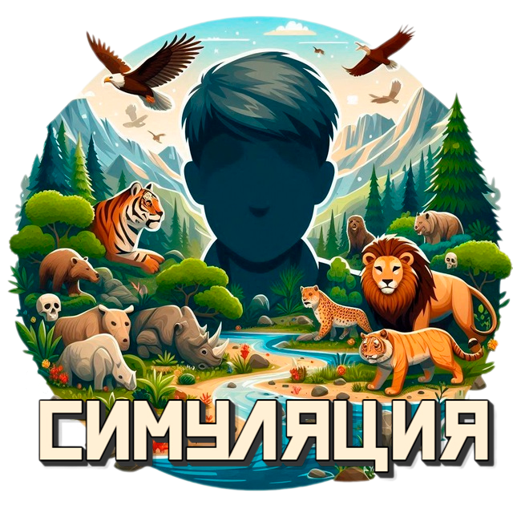
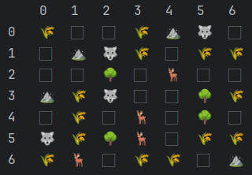

# Симуляция

Суть проекта - пошаговая симуляция 2D мира, населённого травоядными и хищниками. 2D мир представляет собой матрицу NxM, каждое существо или объект занимают клетку целиком, нахождение в клетке
нескольких объектов/существ - недопустимо.  
Кроме существ, мир содержит ресурсы, которыми питаются травоядные и статичные объекты, которые занимают клетку.

Проект создан в рамках **Roadmap Сергея Жукова** -> [ссылка](https://zhukovsd.github.io/python-backend-learning-course/)

  

## Основные механики

* Хищники ищут травоядных, для того, чтобы их атаковать. Хищники имеют силу атаки и диапазон атаки, при атаке у
  травоядного отнимается запас здоровья, равный силе атаки хищника;
* Травоядные ищут ресурсы. И имеют запас здоровья. При сближении с ресурсами, травоядные встают на место ресурса;
* Существа имеют скорость(количество клеток, которое они могу пройти за 1 ход);
* Существа генерирутся в зависимости от пропорций и размера карты.

## Структура проекта

* [public/](public) Директория, содержащая файл для запуска PHP скрипта и загрузчик классов
* [src/](src) Директория, содержащая основные классы проекта
* [data/](data) Директория, содержащая конфигурационные файлы проекта
* [src/Action/](src/Action) Директория, содержащая действия над миром
* [src/Entity/](src/Entity) Директория, содержащая классы для всех существ и объектов существующих в симуляции
* [src/Map/](src/Map) Директория, содержащая карту, хранилище сущностей и рендерер карты
* [src/WayFinder/](src/WayFinder) Директория, содержащая метод поиска пути. На текущий момент
  реализован "[Поиск в ширину](https://ru.wikipedia.org/wiki/Поиск_в_ширину)"
* [src/Simulation.php](src/Simulation.php) Файл, содержащий главный класс приложения. Отвечает за запуск симуляции мира

## Запуск

1. Выполните клонирование проекта `git clone https://github.com/Wh4tisl0ve/Simulation_PHP.git`
2. Начните симуляцию выполнив `php public/index.php` в терминале.
3. После чего запустится симуляция.  
   

4. Наблюдайте за симуляцией и наслаждайтесь :)

## Стек

* PHP 8.3